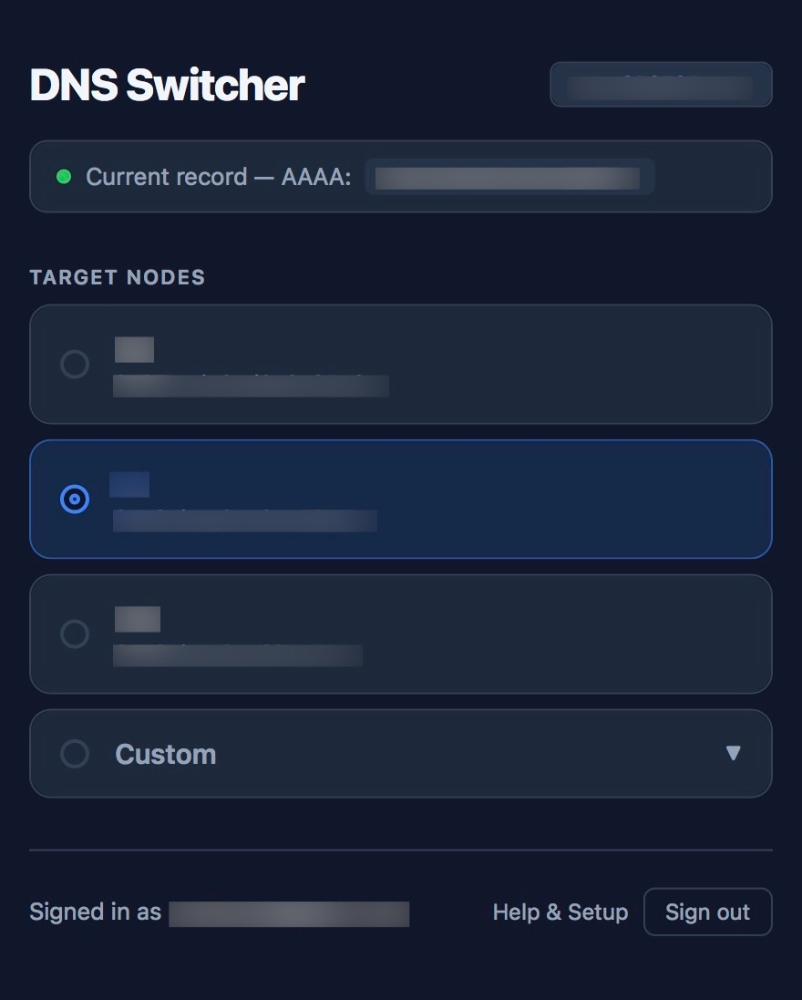

# CF DNS Switcher

⚡ A Cloudflare Worker that lets you instantly switch a domain's DNS record between preconfigured target nodes — directly from your browser, protected by Google OAuth.



## Features

- **One-click switching** between named target nodes (A, AAAA, or CNAME — auto-detected)
- **Custom target** input for arbitrary IPs or hostnames
- **Google OAuth** login restricted to a single trusted email address
- **No database** — sessions use signed HttpOnly cookies (HMAC-SHA256 JWT)
- **Zero dependencies** — a single `index.js` using only Workers runtime APIs
- Built-in `/help` page with full setup instructions (no login required)

## Quick Start

### 1. Clone & configure

```bash
git clone https://github.com/youfou/cf-dns-switcher.git
cd cf-dns-switcher
```

Edit `wrangler.toml` to set your domain and nodes:

```toml
[vars]
DOMAIN      = "sub.example.com"

NODE_NAME_1 = "Home Server"
NODE_HOST_1 = "1.2.3.4"

NODE_NAME_2 = "VPS Tokyo"
NODE_HOST_2 = "5.6.7.8"
```

### 2. Set secrets

```bash
wrangler secret put GOOGLE_EMAIL          # e.g. you@gmail.com
wrangler secret put GOOGLE_CLIENT_ID
wrangler secret put GOOGLE_CLIENT_SECRET
wrangler secret put CF_API_TOKEN
```

### 3. Deploy

```bash
npx wrangler deploy
```

Then update your Google OAuth redirect URI to:
```
https://<your-worker>.workers.dev/auth/callback
```

## Environment Variables

| Variable | Required | Description |
|---|---|---|
| `DOMAIN` | ✅ | Domain whose DNS record is managed |
| `GOOGLE_EMAIL` | ✅ | Google account email allowed to log in |
| `GOOGLE_CLIENT_ID` | ✅ | Google OAuth 2.0 Client ID |
| `GOOGLE_CLIENT_SECRET` | ✅ | Google OAuth 2.0 Client Secret |
| `CF_API_TOKEN` | ✅ | Cloudflare API token with *Edit zone DNS* permission |
| `NODE_NAME_n` | Optional | Display name for node *n* (n = 1, 2, …) |
| `NODE_HOST_n` | Optional | IP address or hostname for node *n* |

Nodes are read from `NODE_NAME_1` / `NODE_HOST_1` upward, stopping at the first missing `NODE_NAME_n`. Only pairs where both name and host are defined are shown.

## DNS Type Detection

The worker inspects the target value and picks the record type automatically:

| Target value | Record type |
|---|---|
| `1.2.3.4` (IPv4) | `A` |
| `2001:db8::1` (IPv6) | `AAAA` |
| `cdn.example.com` (hostname) | `CNAME` |

If an existing record's type needs to change, the old record is deleted and a new one is created.

## Google OAuth Setup

1. Open [Google Cloud Console](https://console.cloud.google.com/) → create or select a project.
2. Go to [APIs & Services → OAuth consent screen](https://console.cloud.google.com/apis/credentials/consent) → set type to *External*, add your email as a test user.
3. Go to [APIs & Services → Credentials](https://console.cloud.google.com/apis/credentials) → **Create Credentials** → **OAuth 2.0 Client ID** → *Web application*.
4. Add `https://<your-worker>.workers.dev/auth/callback` as an authorized redirect URI.
5. Copy the Client ID and Client Secret → set them as secrets with `wrangler secret put`.

## Cloudflare API Token

1. Open [Dashboard → My Profile → API Tokens](https://dash.cloudflare.com/profile/api-tokens).
2. Click **Create Token** → use the *Edit zone DNS* template.
3. Restrict to the specific zone that contains your domain.
4. Copy the token → `wrangler secret put CF_API_TOKEN`.

## Project Structure

```
cf-dns-switcher/
├── index.js        # Entire Worker — routing, auth, DNS logic, UI
└── wrangler.toml   # Deployment config and non-sensitive variables
```

## License

MIT
